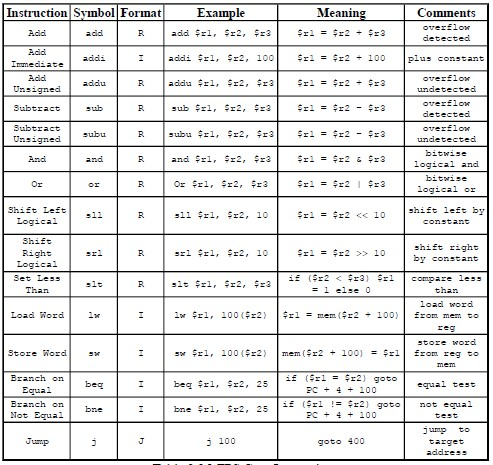
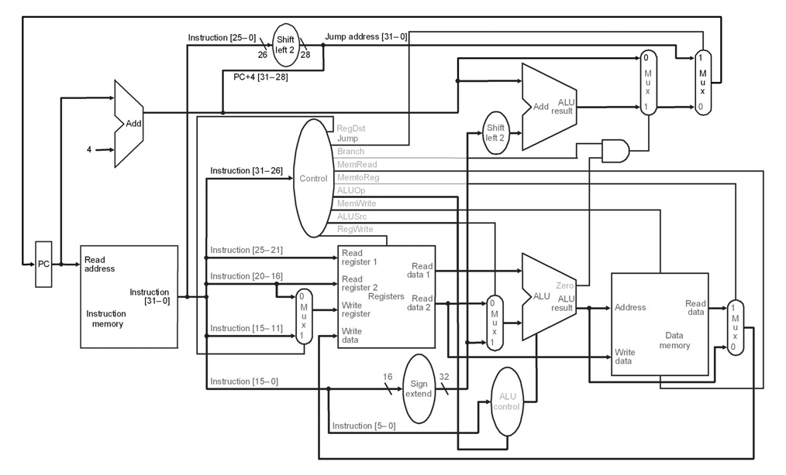

# MIPS CPU Verilog Implementation
An implementation of the MIPS (Microprocessor without Interlocked Pipelined Stages) ISA (Instruction set architecture) using verilog.

## Design
### OVERVIEW
The MIPS single-cycle processor performs the tasks of instruction fetch, instruction decode, execution, memory access and write-back all in one clock cycle. First the PC value is used as an address to index the instruction memory which supplies a 32-bit value of the next instruction to be executed. This instruction is then divided into the different fields.

### Supported instructions

### Building blocks

### Instruction memory
The fetch module fetches the instructions from a file called `im.mips` which contains the machine code for the required instructions in hexadecimal.

### Simulation
The simulation was done on `Model sim` software, A `run.do` file automates the simulation process, it first compiles all the Verilog files,then it executes the `cpu_TB.v` which runs the cpu in the given instruction set in `im.mips` and prints the Registers contents.

## Acknowledgment 
The design specifications and the different building blocks are from the thesis ** A FPGA Implementation of a MIPS RISC Processor
for Computer Architecture Education By: Victor P. Rubio, B.S. ** which depends on the book **Computer Organization and Design – The Hardware/Software Interface by David A. Patterson and John L. Hennessy **

### @ TODO 
- implement a 5 stage pipeline design for the `cpu.v` > `cpu_p.v`